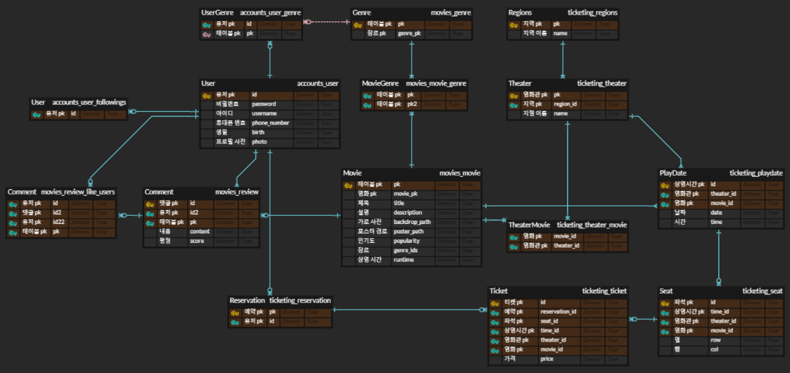

<br />

# 프로젝트 개요

- #### 현재 상영 중인 영화에 대한 정보 및 각 영화에 대한 상세 정보 조회, 평론과 평점을 남길 수 있는 커뮤니티 기능과 실시간 모의 예매 기능 제공
<br />

# 서비스 대표 기능

### 목표 서비스 구현 및 실제 구현 정도

[목표 서비스 구현]
- 영화 CRUD
- 영화의 관람평 CRUD
- 관람평에 대한 좋아요를 누르는 기능
- 관람평을 작성한 작성자를 Follow하는 기능
- 마이프로필 페이지 방문 및 다른 User 프로필 페이지 방문

[추가 구현]
- 목표 서비스를 모두 구현하였습니다.
- 영화 예매하기 기능을 추가하였습니다.
- 영화 예매를 위하여, 지역 - 극장 지점에 대한 더미 데이터를 문화빅데이터 플랫폼에서 추출하였습니다.
- 영화 좌석 및 상영 날짜, 상영 시간을 임의의 데이터로 생성하였습니다.
- kakao 결제하기 기능
- kakao 영화정보 공유하기 기능
- 방문한 User의 Follower/Following User정보를 확인할 수 있습니다.
- 유튜브 API 활용하여 가장 인기 있는 영화의 썸네일 이미지로 슬라이드 스크린을 구성하였습니다. 해당되는 이미지를 누르면, 모달창에 영화 영상이 재생됩니다.


### 서비스 대표 기능에 대한 설명

[영화 예매하기 기능]
- 지역을 선택
- 지점을 선택
- 영화 선택
- 관람 날짜 선택
- 관람 시간 선택
- 예매할 영화 정보를 확인할 수 있는 UI
[좌석 선택]
- 인원 수 선택, 총 인원수가 8명 이상은 예매할 수 없습니다.
- 인원수를 선택한 후 좌석을 선택할 수 있습니다.
- 좌석을 인원수 만큼 선택하면, 다른 좌석을 더이상 선택할 수 없습니다.
- 만일 좌석을 인원수 만큼 선택했음에도, 다른 좌석을 선택한다면, 다시 좌석을 선택할 수 있도록, 선택된 좌석은 초기화 됩니다.
- 좌석을 양식에 맞게 선택하면 결제하기 버튼을 누를 수 있습니다
- 결제하기를 누르면 kakao API의 결제하기 기능으로 가상 결제가 가능합니다.
- 결제가 완료되면 마이 페이지로 이동하여, 예매내역을 확인할 수 있습니다.

<br />

# 개발 환경

- #### Python 3.9.13
- #### Node.js 20.9.0
- #### Vue3 3.3.4 
- #### Django 4.2.7
<br />

# 배포 서버 URL

- #### http://52.79.103.118/
<br />

# 기술 스택
<br />

 
 

<br />

 

<br />


<br />


 
<br />
<br />

# DataBase ERD


<br />

# 프로젝트 폴더 구조

```
SYUPAT_CINEMA    
 ┣ Back-end    
 ┃ ┣ accounts    
 ┃ ┃ ┣ migrations    
 ┃ ┃ ┣ admin.py    
 ┃ ┃ ┣ forms.py    
 ┃ ┃ ┣ models.py    
 ┃ ┃ ┣ serializers.py   
 ┃ ┃ ┣ signals.py    
 ┃ ┃ ┣ urls.py    
 ┃ ┃ ┗ views.py   
 ┃ ┣ media   
 ┃ ┃ ┗ profile   
 ┃ ┃ ┃ ┗ defaultProfile.jpeg   
 ┃ ┣ movies   
 ┃ ┃ ┣ fixtures   
 ┃ ┃ ┃ ┣ genres.json   
 ┃ ┃ ┃ ┣ movies.json   
 ┃ ┃ ┃ ┗ moviesData.json    
 ┃ ┃ ┣ migrations   
 ┃ ┃ ┣ admin.py   
 ┃ ┃ ┣ apps.py   
 ┃ ┃ ┣ forms.py   
 ┃ ┃ ┣ models.py   
 ┃ ┃ ┣ serializers.py   
 ┃ ┃ ┣ urls.py   
 ┃ ┃ ┗ views.py   
 ┃ ┣ mypjt   
 ┃ ┃ ┣ asgi.py   
 ┃ ┃ ┣ settings.py   
 ┃ ┃ ┣ urls.py   
 ┃ ┃ ┗ wsgi.py   
 ┃ ┣ ticketing   
 ┃ ┃ ┣ fixtures   
 ┃ ┃ ┃ ┣ playdates.json   
 ┃ ┃ ┃ ┣ regions.json   
 ┃ ┃ ┃ ┗ theaters.json  
 ┃ ┃ ┣ migrations   
 ┃ ┃ ┣ apps.py   
 ┃ ┃ ┣ models.py   
 ┃ ┃ ┣ serializers.py   
 ┃ ┃ ┣ urls.py   
 ┃ ┃ ┗ views.py    
 ┃ ┣ .env    
 ┃ ┣ db.sqlite3    
 ┃ ┣ manage.py    
 ┃ ┣ requirements.txt    
 ┃ ┗ SQL.sql    
 ┗ Front-end     
 ┃ ┣ dist    
 ┃ ┃ ┣ assets    
 ┃ ┃ ┃ ┣ defaultProfile-e9bc93ce.png   
 ┃ ┃ ┃ ┣ index-b6d36b20.css   
 ┃ ┃ ┃ ┗ index-e3f53ea3.js      
 ┃ ┃ ┣ favicon.ico     
 ┃ ┃ ┗ index.html     
 ┃ ┣ node_modules   
 ┃ ┣ src  
 ┃ ┃ ┣ assets   
 ┃ ┃ ┃ ┗ defaultProfile.png   
 ┃ ┃ ┣ components   
 ┃ ┃ ┃ ┣ MovieCard.vue   
 ┃ ┃ ┃ ┣ MovieReview.vue   
 ┃ ┃ ┃ ┣ Reservations.vue   
 ┃ ┃ ┃ ┣ ReviewCreate.vue   
 ┃ ┃ ┃ ┗ UserReviews.vue   
 ┃ ┃ ┣ router   
 ┃ ┃ ┃ ┗ index.js   
 ┃ ┃ ┣ stores   
 ┃ ┃ ┃ ┣ counter.js   
 ┃ ┃ ┃ ┗ reservation.js   
 ┃ ┃ ┣ views   
 ┃ ┃ ┃ ┣ Ticketing   
 ┃ ┃ ┃ ┃ ┣ SeatView.vue   
 ┃ ┃ ┃ ┃ ┗ TicketingView.vue   
 ┃ ┃ ┃ ┣ HomeView.vue    
 ┃ ┃ ┃ ┣ LoginView.vue   
 ┃ ┃ ┃ ┣ MovieDetailView.vue   
 ┃ ┃ ┃ ┣ ProfileUpdateView.vue   
 ┃ ┃ ┃ ┣ ProfileView.vue   
 ┃ ┃ ┃ ┗ SignupView.vue   
 ┃ ┃ ┣ App.vue   
 ┃ ┃ ┗ main.js   
 ┃ ┣ package-lock.json   
 ┃ ┣ package.json   
 ┃ ┗ vite.config.js   
```
<br />

# 기능 명세서


<br />

# 기능 구현 결과
### main page - youtobu API


### movie detail/like/follow


### 장르별 영화 추천


### 영화 상세 정보 공유 및 예매하기(결제 포함)


<br />

# 팀원 소개 및 소감

<br />

### 이지연 (팀장)

- 역할
```
프론트엔드 50% 
백엔드 50%
```

- 소감
```
엄청 재미있었습니다. 제 적성과 흥미를 알게 되는 경험이었습니다.
그리고 페어와 팀워크가 좋았기 때문에 구현을 빠르게 할 수 있었으며,
어려운 부분을 같이 고민하면서 함께 성장하는 걸 많이 느꼈습니다.
특히 페어가 모르는게 있을때 도움을 줄 수 있어서 진짜 기뻤습니다.

자바스크립트와 파이썬의 새로운 문법과 프레임워크의 전체적인 구조 및 작동 흐름을 알게 되었고,
그 과정에서 스레드, 프로세스, 비동기, http, https 등 다양한 부분에서 CS 스터디에서 배운 내용을 활용할 수 있었습니다.
배운 내용이 어떻게 실제 적용되는지 느꼈고, 그 과정을 프로젝트에 적용하며 코드를 작성하는 것이 큰 재미로 다가왔습니다.

시간이 남고 욕심이 생기다보니 영화 예매하기, 결제하기, 공유하기, 유튜브 API 활용해서 영상 제공하기 등
추가 기능을 구현하게 되었고, 짧다면 짧은 일주일이지만 많이 성장할 수 있는 기회였다고 생각합니다.
```

### 김준수 (팀원)
- 역할
```
프론트엔드 50% 
백엔드 50%
```
- 소감
```
일주일이라는 시간이 짧게 느껴져서 너무 아쉽기도 하지만 그것을 제외하면 정말 만족스러운 프로젝트였습니다.
특히 페어와 팀워크가 좋았기 때문에 일주일이라는 기간이 더 아쉬운 느낌이 듭니다.

프로젝트를 진행하면서 ERD를 작성하고 그 기반으로 model을 만들어 테이블을 생성하고
serializer를 통해 정보를 전달하는 일련의 과정을 직접 해볼 수 있었기 때문에 재미있었습니다.

또한 프로젝트를 배포하는 과정에서 http와 https, 그리고 web server와 WAS 개념에 관하여
스스로가 많이 부족하다는 느낌이 들었으며 다음 프로젝트 전까지 학습하고자 마음을 다잡기도 했습니다.

이외에도 프로젝트 중에 많은 어려움을 만났지만, 꽤 똑똑한 페어 덕분에 수월하게 해결할 수 있었습니다.
그래서인지 이번 프로젝트는 통해 협업에 대한 장점과 팀원의 소중함을 더욱 크게 느낄 수 있었던 경험이 된 것 같습니다. 
```

<br />

# 프로젝트 기간 (2023년 11월 16일 ~ 2023년 11월 24일)

#### 2023년 11월 16일 목요일

- Django
    - Movie, User ERD 설계
    - TMDB API 데이터로 영화 정보 DB에 저장
    - movies
        - urls.py
        - views.py
        - serializers.py
        - models.py
    - accounts
        - urls.py
        - views.py
        - serializers.py
        - models.py
    - Postman으로 CRUD 확인
    - movie 조회 기능 구현
    - review 기능 구현
    - like 기능 구현
    - follow 기능 구현
- Vue
    - library 사용
        - axios
        - bootstrap
        - fontawesome
    - Main 페이지 구현
        - MovieCard.vue
        - MovieDtailView.vue
        - MovieDetailReivews.vue
    - Signup 페이지 구현
    - Login 페이지 구현

<br />

#### 2023년 11월 17일 금요일

- 메인 기능 구현
    - 추천 기능 (평점 반영(추가)) -> (계획변경) 관람객 평점 추가 / 우선순위 반영 X
    - MovieDetailView 구현
    - 좋아요/팔로잉/팔로우
        - CRUD 기능 확인
        - router 설정

- Header nav-bar
    - 로그인 후
        - 프로필
        - 로그아웃
    - 로그인 전
        - 회원가입
        - 로그인

- 프로필 페이지
    - 본인이 작성한 평론 목록 조회 구현
    - 팔로우 / 팔로잉 버튼 추가

- 영화 평론
    - 평론 작성 기능 구현
    - movie reviews와 user reviews 분리
    - 평론 작성자, 평점, 평론, 좋아요 수 구현

- Profile
    - login 한 user 정보 조회
    - 다른 user profile 조회 구현
        - 해당 user가 작성한 review
        - 팔로우 / 팔로잉 기능 구현

- signup
    - Token 기능 구현
    - 회원가입 성공 시 login 된 상태로 메인으로 이동

- logout 기능 구현
    - localStorage.clear
    - router.push main page

<br />

#### 2023년 11월 18일 토요일

- 유저 모델
    - fields에 img 추가
    - 회원가입 프로필 사진 추가/디폴트 사진 추가
    - movie detial - review 작성자 사진 추가

- 회원가입 : 취향 장르 선택 가능
  - 선택안했을때 : 전체 우선순위
  - 선택했을때 : 그 장르의 우선순위

- 프로필 정보 수정
  - 장르 선택 가능
  - 선택한 정보 반영

- review
    - 해당 유저 이미지 클릭 시 작성자의 profile로 이동
    - 관람객 평점 추가

- 회원 탈퇴 기능 추가

<br />

#### 2023년 11월 19일

- User 회원정보 수정 구현
    - 유저 상세 정보 serializer 수정
    - 비밀번호 변경 기능 추가

- main page
    - 전체 인기순위 포스터 6개 나열
    - 유저가 선호하는 장르별로 포스터 6개씩 나열

1. User 회원 정보 수정
   -> 선택된 파일이 없습니다 -> 원래 설정된 사진 이미지

- 영화 예매하기
    - Ticketing ERD 설계 및 테이블 생성
    - 문화공간 공공데이터로 영화관 정보 DB에 저장
    - ticking 관련 view, serializer 기능 구현
    - pinia tickecting stores 생성
    - tickecing Views 폴더

<br />

#### 2023년 11월 20일

- 영화예매하기
    - 영화관 선택 기능 구현
    - 영화관 좌석 view 구현

- 카카오 open API
    - 영화 상세 정보 공유하기 구현
    - 영화 티켓 결제하기 구현

<br />

#### 2023년 11월 21일

- 기능 구현 테스트
    - 카카오톡 공유하기
    - 카카오톡 결제하기
    - 예매내역 확인

- 예매하기
    - 스타일 수정

- main
    - poster 개수, 크기 수정

- profile
    - 댓글 / 결제내역 스타일 수정
    - 댓글 좋아요 기능 아이콘 추가
    - 팔로우/팔로잉 유저 목록 조회 기능 구현

- input form
    - 회원가입 / 로그인 / 회원 정보 수정 / 비밀번호 변경 스타일 수정
    - 로그인 / 회원가입 / 회원 정보 수정 사용 시 알림 추가

- review
    - 평점 스타일 수정
    - 평론 component 스타일 수정
    - 평론 수정 및 삭제 기능 구현

- 토큰이 필요한 기능에 router guard 구현

<br />

#### 2023년 11월 22일 ~ 23년 11월 23일

- 베포 및 테스트
- youtube api 연동
    - 메인 화면 포스터 클릭 시 유튜브 영상 출력
- READMD 작성
- 전체 스타일 수정
    - 모바일 뷰를 고려하여 반응형으로 수정

